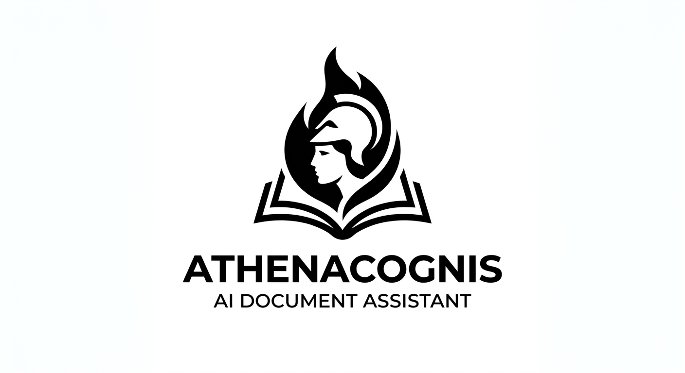
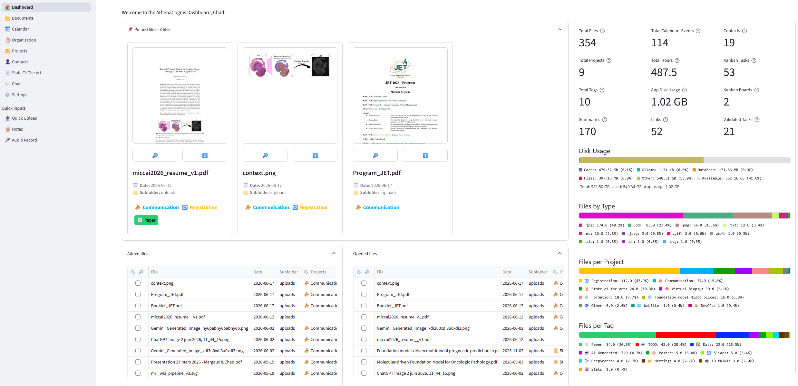
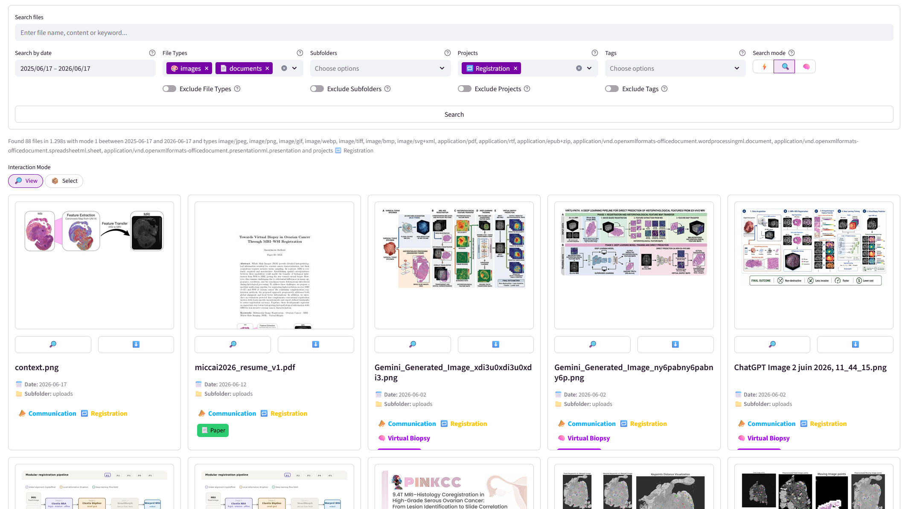
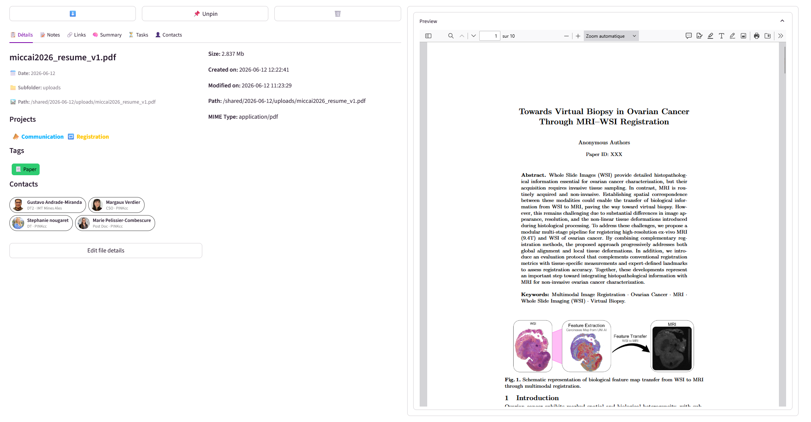
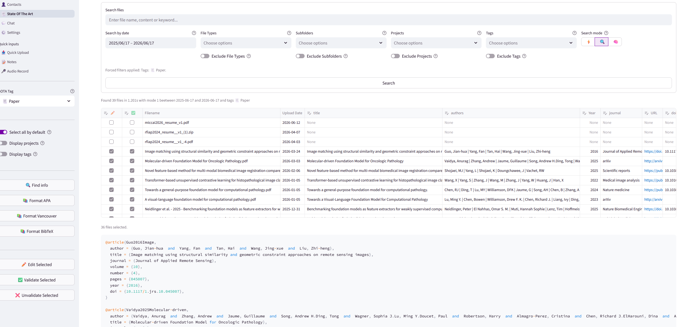
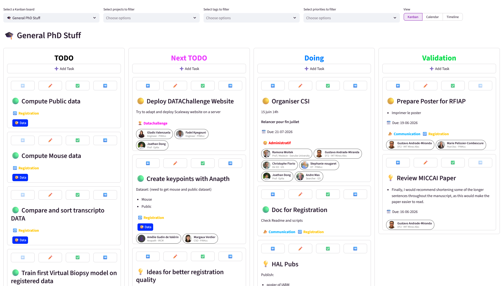
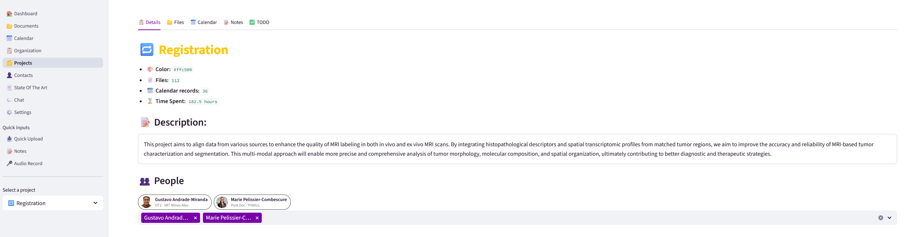
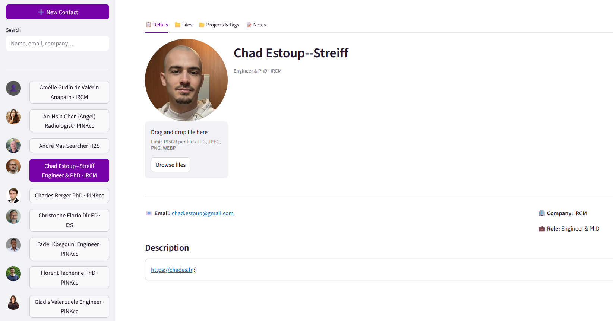
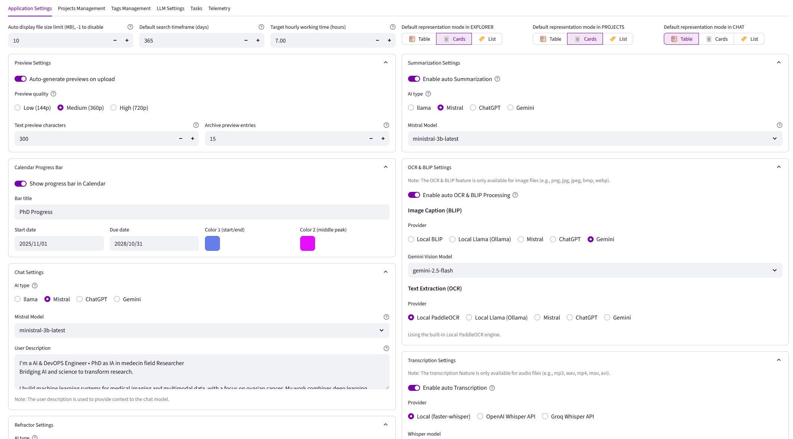

# AthenaCognis

**AthenaCognis** is a self-hosted, AI-powered document management and knowledge assistant.
Inspired by tools like *Paperless*, it combines full-text search, multi-provider AI extraction, project and task management, research bibliography tools, and productivity tracking, all in one web application that keeps your data on your own infrastructure.

## History
I'm currently doing a PhD after obtaining a DevOps engineer degree. Before that, I was an AI & DevOps intern at a startup, my managers were genuinely happy with my output, but they often struggled to follow what I was actually working on. The problem wasn't the work itself; it was me. I've never been great at writing reports, summarising progress, or communicating what I've built.

Starting a PhD made that gap feel even more urgent. Research demands exactly the kind of structured communication I'd always avoided. So I did what any developer would do: I built a tool to solve the problem.

AthenaCognis started as a personal system to organise and track my own work, documents, tasks, notes, time, research papers, in one place, with AI doing the heavy lifting on summaries and reports so I don't have to. What began as a workaround for my own weaknesses turned into something genuinely powerful that saves me a significant amount of time and has noticeably improved how I communicate my work. It lets me focus on what I actually enjoy: research and building things.

I've open-sourced it because the problem it solves isn't unique to me, and if it ends up being useful to other researchers and engineers, that's a nice bonus. (A widely-used open-source tool that supports scientific work also makes for a pretty solid PhD contribution, not going to lie.)

You can visit my website for more of me: [https://chades.fr](https://chades.fr) :)

## 📷 Preview



*Home dashboard with pinned files, recent activity, and at-a-glance statistics.*



*Document search in card view with inline previews, filters, and tag assignments.*



*File viewer with AI extraction results, semantic links, and task queue.*



*Research bibliography page with paper metadata, auto-populate, citation generators, and bulk editor.*



*Kanban board with colour-coded columns, priority levels, and assignee avatars.*



*Project details with linked contacts, files, calendar records, time spent, and TODO checklist.*



*Contact profile with photo, details, linked files, projects, and notes.*


*AI chat assistant with attached files and calendar events as context.*


*Markdown notes editor with live side-by-side preview.*



*Settings panel for application customization.*

## 🚀 Features

### 📂 Document Management
- **Universal file upload**, drag-and-drop with per-file date, project, and tag assignment at upload time
- **Date-organised storage**, files stored under `YYYY-MM-DD/subfolder/` paths
- **Three display modes**, Table, Cards, and List views switchable per page
- **Inline previews**, thumbnail or text snippet shown in search results and card views
- **File viewer**, renders PDF, images, Markdown, code, audio, video, CSV, JSON, ZIP trees, and Jupyter notebooks natively
- **File operations**, rename, move (change date/subfolder), delete, download

### 🔍 Search
- **Three search depths:**
  - ⚡ **FAST**, keyword index only (filename, notes)
  - 🔍 **NORMAL**, adds AI-generated summaries and keywords
  - 🧠 **DEEP**, full document content scan
- **Filters**, date range, file type, subfolder, project, tag, each with an include/exclude toggle
- **Powered by Whoosh**, NGRAM full-text indexing for fuzzy partial-word matching

### 🧠 AI Extraction
- **Auto-summarisation**, LLM-generated summary and keywords, stored per file and used in NORMAL/DEEP search
- **OCR**, PaddleOCR extracts text from images; result displayed per file
- **Image captioning**, local BLIP or cloud vision models (GPT-4o, Mistral Pixtral, Gemini) describe image content
- **Audio / video transcription**, local Faster-Whisper (tiny → large-v3) or OpenAI/Groq cloud APIs
- **Auto-processing toggles**, enable or disable automatic OCR, transcription, summarisation, and preview generation independently per feature

### 🔗 Semantic File Linking
- **Manual links**, add directed links between files with a force weight and a comment
- **AI auto-link**, select a pool of candidate files; the AI scores semantic similarity against the current file and proposes links with editable force values
- **Force-directed graph**, interactive graph visualisation traverses the full link tree from any file
- **Clickable nodes**, clicking a node in the graph navigates directly to that file

### 📋 Kanban & Task Management
- **Multiple boards**, create, rename, and delete unlimited Kanban boards
- **Columns**, colour-coded columns with left/right reorder arrows
- **Tasks**, title, Markdown description, start date, due date, completion toggle
- **Priority levels**, 💡 Idea, 🟢 Low, 🟡 Medium, 🟧 High, 🟥 Critical, 🐞 Bug
- **Tag and project assignment** on individual tasks
- **Three board views:**
  - **Kanban**, column-based card layout with move controls
  - **Timeline**, incoming vs overdue split, grouped by due date with time-left indicators
  - **Calendar**, monthly grid with tasks plotted on their due dates
- **Multi-filters**, filter by project, tag, and priority across all views

### 📝 Notes
- **Date-based notes**, Markdown files browsable and creatable by date
- **Side-by-side editor**, live rendered preview next to the raw Markdown source
- **AI writing assistant**, Brief, Rewrite, Improve, and custom-prompt buttons available on any text area throughout the app
- **Per-file notes**, every file has an attached notes field included in FAST-depth search

### 🗂️ Projects
- **Color-coded projects**, name, description, and custom HEX colour badge
- **Per-project tabs**, Details, Files, Calendar records, Notes, and interactive TODO checklist
- **People**, link contacts to a project directly from the Details tab; linked members shown as avatar pills
- **Time tracking**, calendar records linked to a project accumulate total hours shown per project
- **TODO checklist**, editable table with done/task columns, sorted by completion state

### 👤 Contacts
- **Contact profiles**, name, email, phone, company, role, description, and a circular profile photo (auto-compressed to 256 × 256 JPEG)
- **Sidebar search**, filter contacts by name, email, company, role, description, or notes in real time
- **Per-contact tabs**, Details, Files, Projects & Tags, and Notes
- **File linking**, search and attach any file in the system to a contact; unlink from the same panel
- **Project & tag linking**, associate contacts with projects and tags, shown as colour-coded badges with one-click removal
- **Contact pills**, contacts are rendered as inline avatar + name chips wherever they appear (file viewer, project details, etc.)
- **Notes**, per-contact Markdown notes with the AI writing assistant available

### 🏷️ Tags
- **Colour-coded tags**, create and assign tags with a custom HEX colour
- **Tag filtering**, filter files in the explorer, project views, chat context, and SOTA page
- **Task tags**, the same tag system is applied to Kanban tasks

### 📅 Calendar & Productivity
- **Time log entries**, create records with project, date, start time, duration, description, location, and attendees
- **Monthly calendar view**, scrollable month grid showing files uploaded and hours logged per day, with optional weekends toggle
- **Day status indicators**, ✅ on-target, 🔥 overtime, 🛌 under-time, ⚠️ no hours logged (configurable target with ±1 h tolerance)
- **Progress bar**, optional animated gradient progress bar for a long-running goal (e.g. PhD completion) with configurable title, start/end dates, and two gradient colours
- **Statistics tab**, pie chart (hours by project), bar chart (by day/week/month), and line chart over any date range

### 📃 Research / Bibliography (State of the Art)
- **SOTA tag**, designate any tag as your research corpus; the SOTA page filters to that tag automatically
- **Metadata table**, editable spreadsheet of paper metadata: title, authors, year, source, DOI, URL, volume, issue, pages
- **Auto-populate**, "Find Info" queries CrossRef, arXiv, and PubMed by filename/title and fills in the fields automatically
- **Validation tracking**, per-row ✅ checkbox to mark verified entries; bulk validate/unvalidate selected rows
- **Citation generators**, one-click formatted output in **APA**, **Vancouver**, and **BibTeX**
- **Bulk editor**, select multiple rows and edit metadata or validation status in one dialog

### 💬 Chat Assistant
- **Multi-session**, named sessions with title, description, and full message history
- **File context**, attach any number of files; the assistant receives their summaries, OCR text, and transcription
- **Calendar context**, attach calendar records for time-aware and project-aware Q&A
- **Message presets**, 10 configurable one-click prompt templates (academic writing, publication review, newsletter, etc.) with add/edit/delete management
- **Streaming output**, live token-by-token rendering with queue-position indicator
- **User description**, optional profile text injected into the system prompt for personalised responses

### 🎤 Audio Recording
- **Browser recording**, record audio directly from the microphone in the web UI
- **Auto-upload**, saved as a timestamped WAV file and immediately routed to the file viewer for transcription

### 🖼️ File Preview Generation
- **Background daemon**, preview tasks run in a dedicated thread with a persistent queue
- **Quality levels**, Low (144p), Medium (360p), High (720p), configurable globally
- **Supported formats**, JPEG thumbnails for images and PDFs; text snippets for code/text/Markdown; entry listings for ZIP/TAR/GZ archives; extracted frame for video files
- **Auto-preview on upload** toggle in Settings

### 📊 Dashboard & Statistics
- **At-a-glance metrics**, total files, projects, tags, summaries, links, calendar hours, disk usage
- **File type distribution**, horizontal bar chart of extension breakdown
- **Files per project / tag**, colour-coded bar charts
- **Disk usage widget**, breakdown of model caches, Ollama models, database, and file storage vs total mount capacity
- **Pinned files**, quick-access panel for pinned files shown at the top of the dashboard
- **Recent / today / week files**, quick-access panels on the home screen
- **Optimised loading**, all backend requests fire in parallel; pinned files appear first, then stats one by one, then file panels

### ⚙️ Settings & Health Monitoring
- **Project & tag management**, create, edit, and delete from the Settings UI
- **Daemon health panel**, live status (RUNNING / DEAD) and current task for OCR, transcription, summarisation, and preview background workers
- **Per-task AI model selection**, each AI task (chat, summary, OCR, image caption, transcription, auto-link, text refractor) independently selects a provider and model
- **Password protection**, optional `APP_PWD` environment variable with cookie-based session persistence and configurable timeout

## 🤖 AI Providers

Each task selects its provider and model independently. Cloud providers require an API key configured in **Settings → LLM Settings**.

| Task | Local | Cloud |
|------|-------|-------|
| Chat | Ollama (any model) | Mistral, OpenAI ChatGPT, Google Gemini |
| Summarisation | Ollama | Mistral, OpenAI ChatGPT, Google Gemini |
| Text Refractor | Ollama | Mistral, OpenAI ChatGPT, Google Gemini |
| Auto-link | Ollama | Mistral, OpenAI ChatGPT, Google Gemini |
| OCR (text extraction) | PaddleOCR |, |
| Image caption / vision | Local BLIP, Ollama vision | Mistral Pixtral, GPT-4o / GPT-4.1, Gemini Vision |
| Transcription | Faster-Whisper (tiny → large-v3) | OpenAI Whisper API, Groq (whisper-large-v3 / turbo) |

**Supported cloud models:**

| Provider | Models |
|----------|--------|
| Ollama | Any locally pulled model (e.g. `llama3.2:1b`, `llama3.2:8b`, `llama3.2:70b`, …) |
| Mistral | ministral-3b, ministral-8b, mistral-small, mistral-medium, mistral-large, magistral-small, magistral-medium |
| OpenAI | gpt-3.5-turbo, gpt-4, gpt-4o, gpt-4o-mini, gpt-4.1, gpt-4.1-mini, gpt-4.1-nano |
| Gemini | gemini-2.0-flash-lite, gemini-2.0-flash, gemini-2.5-flash-lite, gemini-2.5-flash, gemini-2.5-pro |
| Groq | whisper-large-v3, whisper-large-v3-turbo *(transcription only)* |

## 📦 Tech Stack

| Layer | Technology |
|-------|-----------|
| Backend | Python 3, FastAPI, SQLAlchemy |
| Frontend | Streamlit |
| Database | MariaDB 10.6 |
| Full-text search | Whoosh (NGRAM indexing) |
| Local LLM inference | Ollama |
| Cloud AI | OpenAI, Mistral AI, Google Gemini, Groq |
| OCR | PaddleOCR |
| Image captioning | BLIP (local) |
| Transcription | Faster-Whisper (local), OpenAI Whisper API, Groq |
| Deployment | Docker, Docker Compose |
| DB admin | phpMyAdmin |

## 📁 Supported File Types

| Category | Formats |
|----------|---------|
| Documents | PDF, DOCX, TXT, MD, HTML, EPUB |
| Spreadsheets / Data | CSV, XLSX, JSON, JSONL, YAML, TOML |
| Images | JPEG, PNG, WebP, GIF, BMP, TIFF, HEIC, SVG |
| Audio | MP3, WAV, OGG, FLAC, AAC, WMA, M4A |
| Video | MP4, AVI, MOV, MKV, WebM, WMV, FLV, MPEG |
| Code | Python, JavaScript, TypeScript, Go, Rust, Java, C, C++, PHP, Ruby, Swift, Kotlin, R, SQL, Shell, and more |
| Notebooks | Jupyter (.ipynb) |
| Archives | ZIP, TAR, GZ, BZ2, TGZ, 7Z, RAR |

## 🏗️ Architecture

The application runs as five Docker services on a shared internal network:

| Service | Image | Purpose | Host Port |
|---------|-------|---------|-----------|
| `back_db` | `mariadb:10.6` | Relational database storing all metadata, tasks, links, notes, and settings |, (internal) |
| `pma` | `phpmyadmin/phpmyadmin` | Web-based database admin UI | `PMA_PORT` |
| `ollama` | `ollama/ollama` | Local LLM inference server; models stored in `DATA_PATH/ollama` |, (internal) |
| `back` | Custom (FastAPI) | REST API + background AI daemons + file management | `BACK_PORT` |
| `front` | Custom (Streamlit) | Web UI; communicates with the backend over the internal network | `FRONT_PORT` |

**Background daemons** (run as threads inside the `back` container):

- `OCRManager`, processes OCR and BLIP image-captioning tasks from the queue
- `TranscriptionManager`, transcribes audio and video files
- `SummarizeManager`, generates LLM summaries and keyword lists
- `PreviewManager`, generates image/text/archive preview thumbnails
- `ChatManager`, handles streaming LLM responses asynchronously

## 🚀 Quick Start

### Prerequisites

- [Docker](https://docs.docker.com/engine/install/) and [Docker Compose](https://docs.docker.com/compose/install/)
- At least **8 GB RAM** allocated to Docker (Docker Desktop → Settings → Resources)
- A storage path on your host for persistent data

> **Note:** A GPU is optional. The app runs on CPU alone; local AI tasks (OCR, transcription, summarisation) will simply be slower.

### 1. Clone the repository

```bash
git clone https://github.com/yourusername/athenacognis.git
cd athenacognis
```

### 2. Configure environment

```bash
cp .env_ex .env
```

Open `.env` and fill in the values (see [Configuration](#%EF%B8%8F-configuration) below).

### 3. Start the application

```bash
./up.sh
```

The frontend will be available at `http://localhost:<FRONT_PORT>`.

### 4. (Optional) Pull a local LLM model

Go to **Settings → LLM Settings → Local Llama**, enter a model name (e.g. `llama3.2:8b`) and click **Pull Model**. Browse available models at [ollama.com/library](https://ollama.com/library).

### 5. Stop the application

```bash
./down.sh
```

## ⚙️ Configuration

All core configuration is done via the `.env` file:

| Variable | Required | Description | Example |
|----------|----------|-------------|---------|
| `PROJECT_NAME` | ✅ | Internal Docker Compose project name | `athenacognis` |
| `USER_NAME` | ✅ | Your name, shown in the dashboard greeting | `chad` |
| `DATA_PATH` | ✅ | Absolute path on the host for all persistent data (files, database, models, caches) | `/data/athenacognis` |
| `BACK_PORT` | ✅ | Host port for the FastAPI backend | `8400` |
| `FRONT_PORT` | ✅ | Host port for the Streamlit frontend | `8401` |
| `PMA_PORT` | ✅ | Host port for phpMyAdmin | `8402` |
| `DATABASE_PASSWORD` | ✅ | MariaDB root password | `supersecret` |
| `APP_PWD` | ☑️ optional | Password to protect the web UI; leave empty to disable authentication | `mypassword` |
| `LOGIN_TIMEOUT` | ☑️ optional | Session duration in seconds when `APP_PWD` is set (default: 86400) | `86400` |

API keys for cloud AI providers (Mistral, OpenAI, Gemini, Groq) are stored in the application database and configured through **Settings → LLM Settings**, they do not need to be set in `.env`.

## 🎓 License

MIT License © Chad Estoup-Streiff
